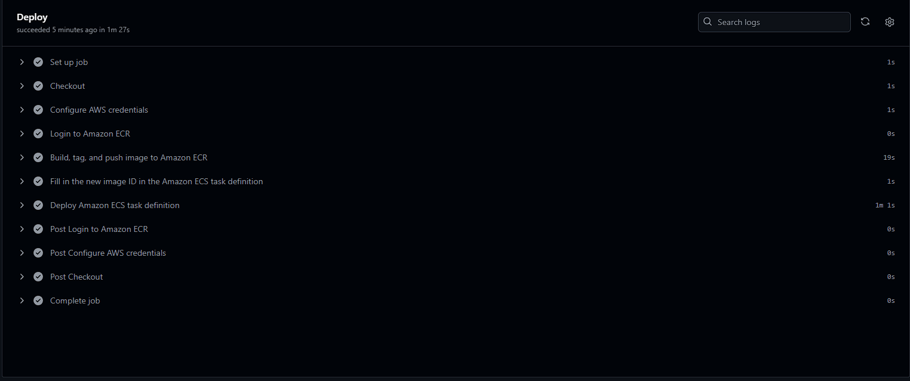

# Deploy to Amazon ECS service with GitHub Actions workflow 
## **1️⃣ Estructura de capetas para el despliegue**

 ┣  📂 .aws/**main-auth-service-task-def.json**  
 ```code
 {
    "family": "main-auth-service-task-def",
    "networkMode": "awsvpc",
    "executionRoleArn": "arn:aws:iam::862695242185:role/ecsTaskExecutionRole",
    "taskRoleArn": "arn:aws:iam::862695242185:role/ecsTaskExecutionRole",
    "containerDefinitions": [
      {
        "name": "AuthService",
        "image": "REPLACE_IMAGE",
        "portMappings": [
          {
            "containerPort": 5000,
            "hostPort": 5000,
            "protocol": "tcp",
            "appProtocol": "http"
          }
        ],
        "essential": true,
        "logConfiguration": {
          "logDriver": "awslogs",
          "options": {
            "awslogs-group": "/ecs/main-auth-service-task-def",
            "awslogs-region": "us-east-1",
            "awslogs-stream-prefix": "ecs",
            "mode": "non-blocking",
            "awslogs-create-group": "true",
            "max-buffer-size": "25m"
          }
        }
      }
    ],
    "requiresCompatibilities": [ "FARGATE" ],
    "cpu": "1024",
    "memory": "3072",
    "runtimePlatform": {
      "cpuArchitecture": "X86_64",
      "operatingSystemFamily": "LINUX"
    }
  }
  
 ```
 ┣  📂 .github/workflows/**GitHubDeploytoAmazonECS.yml**
 
 ```code
 name: Deploy to Amazon ECS

on:
  push:
    branches: [ "main" ]

env:
    AWS_REGION: us-east-1
    ECR_REPOSITORY: auth_services_repo
    ECS_SERVICE: auth-service
    ECS_CLUSTER: main-cluster-gamer-vault-ggeasy
    ECS_TASK_DEFINITION: .aws/main-auth-service-task-def.json
    CONTAINER_NAME: AuthService
                                        
permissions:
  contents: read

jobs:
  deploy:
    name: Deploy
    runs-on: ubuntu-latest
    environment: production

    steps:
    - name: Checkout
      uses: actions/checkout@v4

    - name: Configure AWS credentials
      uses: aws-actions/configure-aws-credentials@v1
      with:
        aws-access-key-id: ${{ secrets.AWS_ACCESS_KEY_ID }}
        aws-secret-access-key: ${{ secrets.AWS_SECRET_ACCESS_KEY }}
        aws-region: ${{ env.AWS_REGION }}

    - name: Login to Amazon ECR
      id: login-ecr
      uses: aws-actions/amazon-ecr-login@v1

    - name: Build, tag, and push image to Amazon ECR
      id: build-image
      env:
        ECR_REGISTRY: ${{ steps.login-ecr.outputs.registry }}
        IMAGE_TAG: ${{ github.sha }}
      run: |
        # Build a docker container and
        # push it to ECR so that it can
        # be deployed to ECS.
        docker build -t $ECR_REGISTRY/$ECR_REPOSITORY:$IMAGE_TAG .
        docker push $ECR_REGISTRY/$ECR_REPOSITORY:$IMAGE_TAG
        echo "image=$ECR_REGISTRY/$ECR_REPOSITORY:$IMAGE_TAG" >> $GITHUB_OUTPUT

    - name: Fill in the new image ID in the Amazon ECS task definition
      id: task-def
      uses: aws-actions/amazon-ecs-render-task-definition@v1
      with:
        task-definition: ${{ env.ECS_TASK_DEFINITION }}
        container-name: ${{ env.CONTAINER_NAME }}
        image: ${{ steps.build-image.outputs.image }}

    - name: Deploy Amazon ECS task definition
      uses: aws-actions/amazon-ecs-deploy-task-definition@v1
      with:
        task-definition: ${{ steps.task-def.outputs.task-definition }}
        service: ${{ env.ECS_SERVICE }}
        cluster: ${{ env.ECS_CLUSTER }}
        wait-for-service-stability: true

 ```

